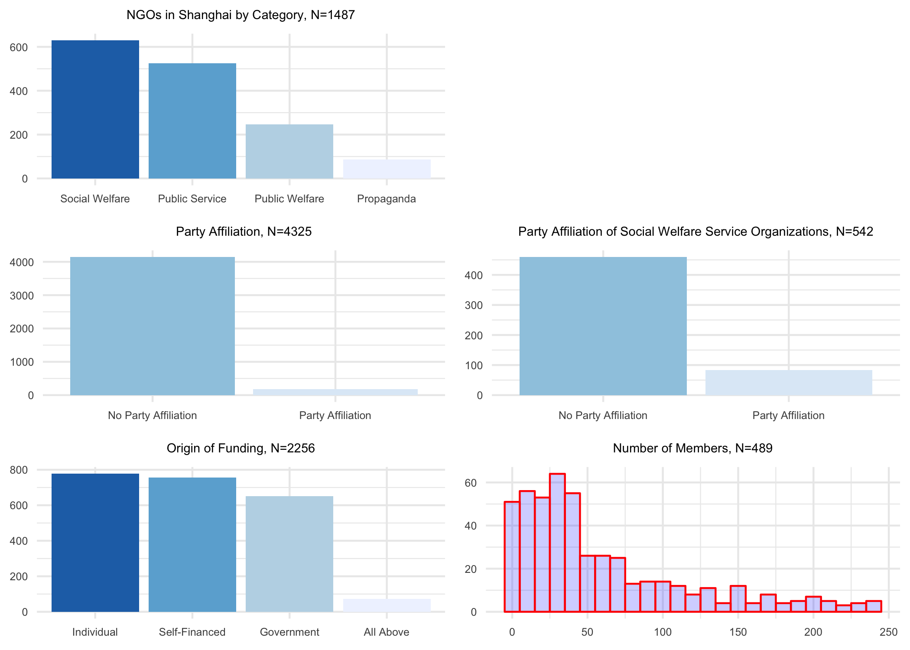
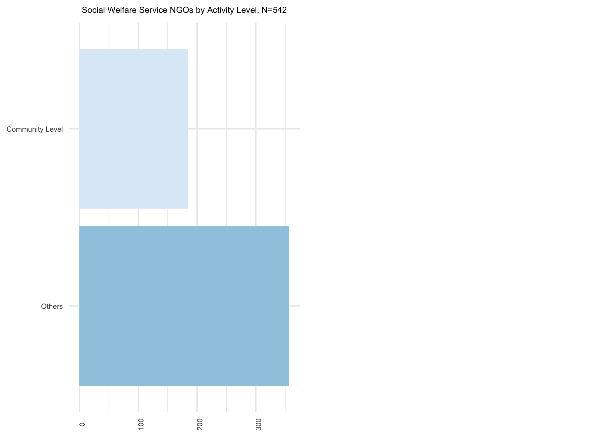
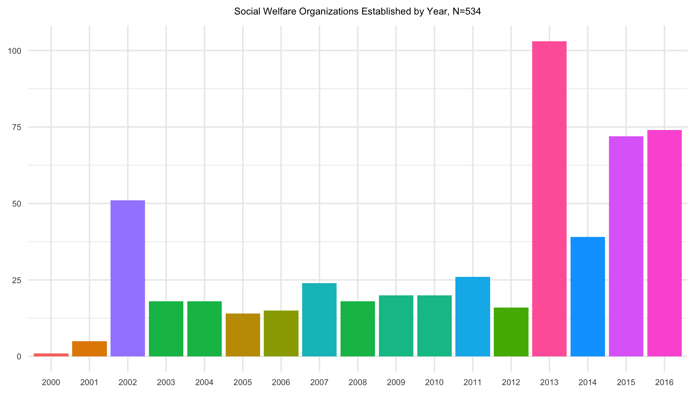

Shanghai-NGO-Analysis
================
Eunhou Esther Song
1/28/2019

This memo visualizes data used for Chapter 4 of my dissertation. This
data was used to qualitatively categorize organizations according to
service type, and was later used to obtain a category-wise list across
districts in Shanghai.

#### Analysis Procedure

##### Basic Web Scraping and Word Detection

The analysis procedure included the following:

  - Web-scraping the official [Shanghai social organization
    website](http://stj.sh.gov.cn/) which included information on the
    name of social organization, location, established date, activities,
    annual government reports that include supervisory organization,
    origin of funding at establishment, etc. The data set includes
    information on registered organizations up until March 11, 2017.

  - Reading the activities of the organizations to categorize
    organizations by activity. Except for categorization by MOCA, there
    is no proper categorization for those that are not categorized. I
    read activities of 100 organizations that were *not* categorized,
    and categorized these organizations accordingly. The categories in
    the data includes:
    
      - Six categories made by MOCA are **elderly care, women and
        children, disabled, re-employment, poverty relief, legal**
    
      - `public service` The former includes organizations that take on
        administrative roles, party-building, community governance, and
        social organization management.
    
      - `public welfare` Organizations that specifically mention public
        work (*gongyi xiangmu*) or public interest (*gongyi*). These
        three categorizes were created by finding organizations which
        mentioned the following word or words in their activities
        description.
    
      - `migrant` MOCA does not categorize organizations for migrant
        workers, so these were categorized separately. There was one
        caveat when conding migrant NGOs. Most of these organizations
        were non-profit schools registered under Ministry of Education.
        To leave out schools, I created a separate variable `sup_org_ed`
        which denotes organizations which have MOE as a supervisory
        organization. The charts below therefore displays NGOs that
        serve the migrant population leaving out schools for migrant
        children.
    
      - `propaganda` Organizations take on roles of propagating
        party-state policy doctrines

  - Create `party affiliation` category by using information on
    supervisory organization. Although having a party organization as a
    supervisory organizations does not imply *direct* affiliation nor
    being a direct subsidiary of a party organization (this is because,
    supervisory organization is needed for registration not for other
    purposes), yet the fact that having a party organization as a
    supervisory organization implies a connection.

  - Parsing annual reports. The annual reports included information on
    origins of funding and number of memebrs, where responses were
    categorized as “individual”, “self-financed”, “government”, and “all
    of above”.

#### Words Used for Categorization Based on Qualitative Reading

  - The collected data includes description of activities these
    organizations pursue. Below are examples of these
    descriptions:

<!-- end list -->

    ## [1] 学习和宣传人民代表大会制度；交流和总结人大工作经验；研究和考察地方人大工作实务。为人大工作制度化规范化建设发挥应有作用。（凡涉及行政许可的，凭行政许可开展业务活动。）
    ## [2] 社区工作者管理                                                                                                                                                        
    ## 3724 Levels:  ...

  - Below includes words that were used to categorize organizations
    based on activities:

<!-- end list -->

    # public service organizations
    ['社区管里',
    '治安',
    '综合治理',
    '人口管理',
    '外来人口登记管理',
    '外来人口管理',
    '公共管理',
    '卫生管理',
    '环境管理',
    '登记管理',
    '社会组织',
    '民间组织',
    '群众组织',
    '消防',
    '社会管理',
    '社会组织',
    '人民调解',
    '矛盾调处',
    '综合帮扶',
    '综合协管服务',
    '党建',
    '社区事务',
    '公共文化',
    '公共文化服务',
    '体育设施',
    '社区环境',
    '综合协管',
    '社区矛盾调解',
    '社会组织孵化',
    '民生服务',
    '民生类服务',
    '社区民生服务',
    '便民',
    '便民服务',
    '社区服务',
    '社区居民服务',
    '互助',
    '公益类服务',
    '公益性服务',
    '市民综合帮扶',
    '社区事务',
    '综合服务',
    '社会便民服务']
    
    # public welfare organizations
    ['公益活动','公益性活动','公益类活动','公益项目']
    
    # organizations assist migrant workers
    ['流动','外来','农民工']
    
    # propaganda
    ['思想道德',
    '优生优育知识的宣传',
    '人口计划生育',
    '人口与计生',
    '人口计生',
    '政策宣传',
    '精神文明建设',
    '文明',
    '宣传党的政策方针',
    '宣传党的']

#### Charts

<!-- -->

<!-- -->
<!-- -->

<!-- -->
